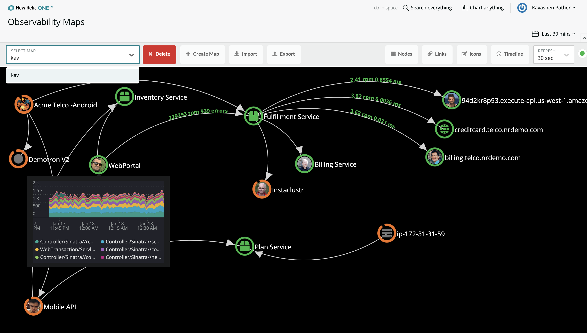

[](https://opensource.newrelic.com/oss-category/#new-relic-one-catalog-project)

# Observability Maps (nr1-observability-maps)

  [](https://snyk.io/test/github/newrelic/nr1-observability-maps)

## Overview

Observability Maps allows you to create a view beyond a traditional service map.

Using Observability Maps you can make connections between different types of entities, not limited to services. You can also create your own connection points based on data available in New Relic.

Right click on nodes and links for further configuration options and shortcuts.




## Dashboard Widget

You can also add this to your favorite dashboard by navigating to Apps > Custom Visualizations and selecting Observability Maps Widget.


## Open source license

This project is distributed under the [Apache 2 license](LICENSE).

## Dependencies

Requires data in NRDB from any or all of the New Relic products.

## Getting started

1. Ensure that you have [Git](https://git-scm.com/book/en/v2/Getting-Started-Installing-Git) and [NPM](https://www.npmjs.com/get-npm) installed. If you're unsure whether you have one or both of them installed, run the following command. (If you have them installed these commands will return a version number, if not, the commands won't be recognized.)

   ```bash
   git --version
   npm -v
   ```

2. Install the [New Relic One CLI](https://one.newrelic.com/launcher/developer-center.launcher) by going to [this link](https://one.newrelic.com/launcher/developer-center.launcher) and following the instructions (5 minutes or less) to install and set up your New Relic development environment.

3. Run the following command to clone this repository and run the code locally against your New Relic data:

   ```bash
   nr1 nerdpack:clone -r https://github.com/newrelic/nr1-observability-maps.git
   cd nr1-observability-maps
   nr1 nerdpack:serve
   ```

Visit [https://one.newrelic.com/?nerdpacks=local](https://one.newrelic.com/?nerdpacks=local), navigate to the Nerdpack, and :sparkles:

## Deploying this Nerdpack

Open a command prompt in the Nerdpack's directory,and run the following commands.

```bash
# To create a new uuid for the nerdpack so that you can deploy it to your account:
# nr1 nerdpack:uuid -g [--profile=your_profile_name]

# To see a list of APIkeys / profiles available in your development environment:
# nr1 profiles:list

nr1 nerdpack:publish [--profile=your_profile_name]
nr1 nerdpack:deploy [-c [DEV|BETA|STABLE]] [--profile=your_profile_name]
nr1 nerdpack:subscribe [-c [DEV|BETA|STABLE]] [--profile=your_profile_name]
```

Visit [https://one.newrelic.com](https://one.newrelic.com), navigate to the Nerdpack, and more :sparkles:

## Community Support

New Relic hosts and moderates an online forum where you can interact with New Relic employees as well as other customers to get help and share best practices. Like all New Relic open source community projects, there's a related topic in the New Relic Explorers Hub. You can find this project's topic/threads here:

[https://discuss.newrelic.com/t/nr1-observability-maps-nerdpack/93091](https://discuss.newrelic.com/t/nr1-observability-maps-nerdpack/93091)

Please do not report issues with Observability Maps to New Relic Global Technical Support. Instead, visit the [`Explorers Hub`](https://discuss.newrelic.com/c/build-on-new-relic) for troubleshooting and best-practices.

## Issues / enhancement requests

Issues and enhancement requests can be submitted in the [Issues tab of this repository](../../issues). Please search for and review the existing open issues before submitting a new issue.

## Security

As noted in our [security policy](https://github.com/newrelic/nr1-observability-maps/security/policy), New Relic is committed to the privacy and security of our customers and their data. We believe that providing coordinated disclosure by security researchers and engaging with the security community are important means to achieve our security goals.
If you believe you have found a security vulnerability in this project or any of New Relic's products or websites, we welcome and greatly appreciate you reporting it to New Relic through [HackerOne](https://hackerone.com/newrelic).

## Contributing

Contributions are welcome (and if you submit a enhancement request, expect to be invited to contribute it yourself :grin:). Please review our [Contributors Guide](CONTRIBUTING.md).

Keep in mind that when you submit your pull request, you'll need to sign the CLA via the click-through using CLA-Assistant. If you'd like to execute our corporate CLA, or if you have any questions, please drop us an email at opensource@newrelic.com.
